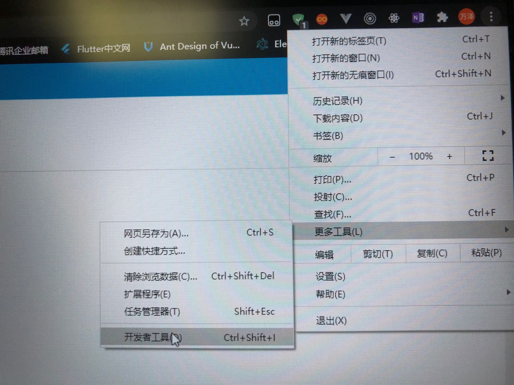

## 禁止用户打开浏览器控制台

#### 最近在做公司的网站，碰到老大提了一个奇葩的需求（在网站上线后，不要让用户看到控制台的内容），我当时惊了，为什么要禁用呢？对于会编程的人来说，禁用了也无济于事，人家还是有办法去打开控制台。对于普通用户来说，一般人也不会去打开控制台。但是这个是老大要求做的，作为小弟我不得不去执行。

#### 在我的认知中，打开控制台有以下几种方法：

    鼠标右键点击网页选择检查，F12打开控制台，Ctrl+Shift+I打开控制台，Ctrl+Shift+C打开控制台，Ctrl+U，Shift+F10

#### 上面列举的几种方法都是可以利用JS来控制，附上代码：

```
    window.onload = function () {
        //禁用开发者工具
        document.onkeydown = function () {
            var e = window.event || arguments[0];
            //F12
            if (e.keyCode == 123) {
                return false;
                //Ctrl+Shift+I
            } else if ((e.ctrlKey) && (e.shiftKey) && (e.keyCode == 73)) {
                return false;
                //Shift+F10
            } else if ((e.shiftKey) && (e.keyCode == 121)) {
                return false;
                //Ctrl+U
            } else if ((e.ctrlKey) && (e.keyCode == 85)) {
                return false;
            }else if((e.ctrlKey) && (e.shiftKey) && (e.keyCode == 67)){
                return false;
                //Ctrl+Shift+C
            }
        };
        document.oncontextmenu = function (event) {
            event.preventDefault();
        };
        // 禁止选中页面内容
        if (document.all) {
            document.onselectstart = function () {
                return false;
            }; //for ie
        } else {
            document.onmousedown = function () {
                return false;
            };
            document.onmouseup = function () {
                return true;
            };
        }
        document.onselectstart = new Function('event.returnValue=false;');

        /*你只要修改页面元素我就重新加载一次数据,让你无法修改页面元素（不支持IE9以下浏览器）*/
        if (window.addEventListener) {
            window.addEventListener("DOMCharacterDataModified", function () {
                window.location.reload();
            }, true);
            window.addEventListener("DOMAttributeNameChanged", function () {
                window.location.reload();
            }, true);
            window.addEventListener("DOMCharacterDataModified", function () {
                window.location.reload();
            }, true);
            window.addEventListener("DOMElementNameChanged", function () {
                window.location.reload();
            }, true);
            window.addEventListener("DOMNodeInserted", function () {
                window.location.reload();
            }, true);
            window.addEventListener("DOMNodeInsertedIntoDocument", function () {
                window.location.reload();
            }, true);
            window.addEventListener("DOMNodeRemoved", function () {
                window.location.reload();
            }, true);
            window.addEventListener("DOMNodeRemovedFromDocument", function () {
                window.location.reload();
            }, true);
            window.addEventListener("DOMSubtreeModified", function () {
                window.location.reload();
            }, true);
        }
    }

```
#### 有一些朋友可能会说，既然这样的话，何不直接禁用网站上的所有键盘操作事件。我之前也考虑过这种写法，但是当你遇到网站有某些需要用户输入的内容，这种做法就会不合理。

***

#### 当然，你要是简单的认为这样做就能禁止打开控制台，也就太瞧不起程序员了，在谷歌浏览器的设置中同样也可以打开控制台，完全鼠标操作，不需要键盘操作。。。



#### 遇到上面这种情况，我也在网上看到了解决办法，利用JS检测控制台是否打开，如果打开的话，就跳转到其他的页面，例如百度：

```
    var ConsoleManager={
            onOpen:function(){
                alert("Console is opened")
            },
            onClose:function(){
                alert("Console is closed")
            },
            init:function(){
                var self = this;
                var x = document.createElement('div');
                var isOpening = false,isOpened=false;
                Object.defineProperty(x, 'id', {
                    get:function(){
                        if(!isOpening){
                            self.onOpen();
                            isOpening=true;
                        }
                        isOpened=true;
                    }
                });
                setInterval(function(){
                    isOpened=false;
                    console.info(x);
                    console.clear();
                    if(!isOpened && isOpening){
                        self.onClose();
                        isOpening=false;
                    }
                },200)
            }
        }

        ConsoleManager.onOpen = function(){
            //打开控制台，跳转到百度
            try{
                window.open('https://www.baidu.com/',target='_self');
            }catch(err){
                var a = document.createElement("button");
                    a.onclick=function(){
                    window.open('https://www.baidu.com',target='_self');
                }
                a.click();  
            }
        }
        ConsoleManager.onClose = function(){
            alert("Console is closed!!!!!")
        }
        ConsoleManager.init();

```

#### 这个算是解决用户打开控制台的终极武器，但是对于用户体验非常不好，建议大家也不要采用，禁用我上面所说的几种即可。如果真的有人想要打开控制台，你又怎能拦得住。