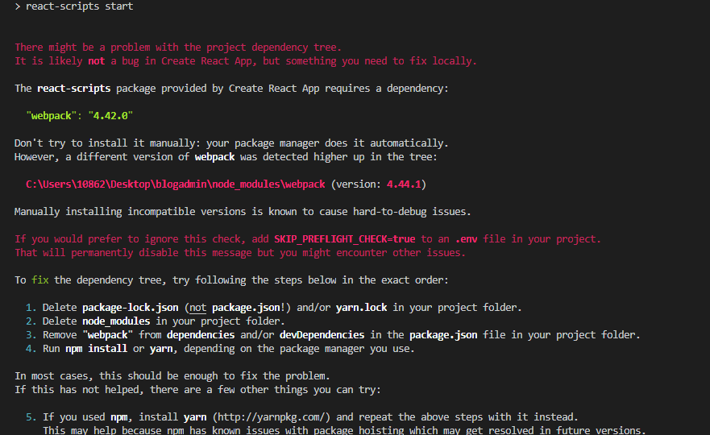

### 今天准备打算用react脚手架搭建一个后台管理系统，在一系列前提工作完成之后，编译的时候出现了以下错误，如图。



#### 出现这个问题的主要原因是因为webpack的版本过高，我全局安装的webpack版本是4.44.1，然后这个项目需要的webpack版本是4.42.0，解决办法就是在开发环境里重新安装它需求的webpack版本，从图中可以看出需求版本号为4.42.0。

``` 
npm install --save-dev webpack@4.42.0 
```

#### 之前也没遇到过这种情况，记录一下。